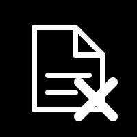

# NoteX

### A Minimal, Local-first, Markdown-based Note Taking App

*Local-First • Privacy-Focused • Cross-Platform • Cloud-Syncable*

[Features](#-features) • [Installation](#-installation) • [Contributing](/docs/CONTRIBUTING.md)

---

## ✨ Features

### 📦 **Lightweight**
- Small installation size ~5MB
- Minimal resource usage
- Fast startup times

### ⚡ **Performant**
- Built with Tauri (Rust + Vue 3) for blazing fast speeds
- Smooth loading of large note collections
- Fast, reliable local SQLite storage

### 🔄 **Cloud Sync**
- Save your notes anywhere on your filesystem
- Use with OneDrive, Google Drive, Dropbox, or any cloud storage

### 📝 **Markdown Support**
- Write your notes in plain text files, take your data anywhere
- Supports GitHub Flavored Markdown (GFM)

### 📅 **Smart Organization**
- Organize notes with hashtags (`#work`, `#personal`, etc.)
- Fuzzy search with real-time filtering
- Calendar view with note count indicators per day

### 🎨 **Beautiful Design**
- Clean, minimal and has light/dark themes
- Mobile-responsive layout

## 📦 Installation
Check the [Releases](https://github.com/cadamsdev/notex/releases) page for platform-specific installers.

---

**If you find NoteX useful, please consider giving it a ⭐ on GitHub!**

Made with ❤️ by [Chad Adams](https://github.com/cadamsdev)

